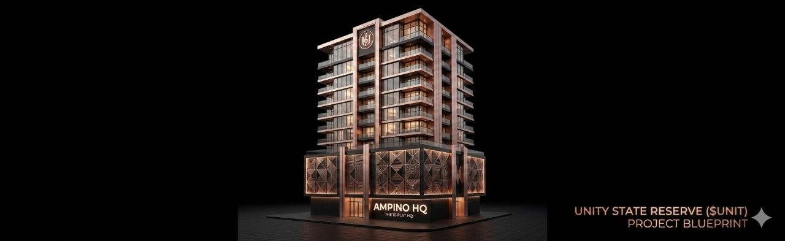

# 🏗 Unity State Reserve ($UNIT) Protocol
### Official Blueprint for the Ampino 10-Flat HQ

## 🛰 The Vision: From Craftsmanship to Architecture
The Unity State Reserve ($UNIT) is an immutable sovereign protocol built to fund the future of Ampino music. By bypassing traditional banking systems, we use the Token-2022 standard to build physical landmarks from digital capital.

---

## 🏛 The Ampino HQ Blueprint
Every transfer of $UNIT fuels the construction of this 10-flat architectural landmark.

### Floor Plan:
* Levels 1-3: High-end Recording Studios & Sound Engineering Suites.
* Levels 4-9: Professional Residencies for Ampino Artists & Web3 Architects.
* Level 10: The Unity State Command Center.

---

## 🛡 The Protocol Law (Immutable)
- Mint Authority: Revoked (Supply locked at 49 Billion).
- Freeze Authority: Revoked (Permissionless).
- Self-Funding Engine: 1% Transfer Tax for Ampino Construction.
- Whale Shield: 5,000 $UNIT tax cap (Active Epoch 964).

"Rise from the dust—the foundation is laid."
